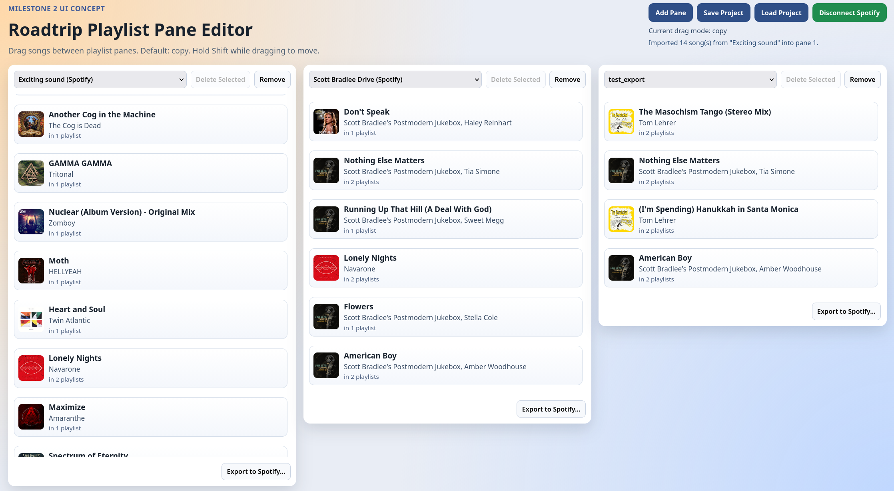

# Rob's Road-trip Playlist Editor

A local-first playlist workspace for comparing and editing multiple playlists at once.
The UI shows multiple playlist panes side by side so you can drag songs between playlists,
reorder tracks within a playlist, and quickly shape alternatives before exporting.



Current status:
- Milestones 0-3 are complete.
- The app is useful now as a personal local editor with Spotify discovery/import/export.
- AWS deployment is supported via CDK.

## Installation and Deployment

Use `INSTALL.md` for step-by-step setup and deployment instructions:
- local run with no integrations
- Spotify setup
- Google setup
- AWS account/bootstrap/deploy flow
- least-privilege deploy policy generation

## What You Can Do Today

- Open multiple playlist panes and switch which playlist each pane displays.
- Drag songs between panes (copy or move) and reorder within a pane.
- Create playlists, remove songs from a list, delete lists, and close panes.
- Save/load project state locally as JSON.
- Connect Spotify, import playlists, and export pane content to a new Spotify playlist.
- Search Spotify into any pane, keep search result lists in the project, and load more results.

## Integrations and Runtime Notes

- Spotify OAuth uses Authorization Code + PKCE and only requires client ID in frontend env.
- Google login uses Google Identity Services in the browser.
- Local backend (`npm run dev:api`) is a local Node process with in-memory data.
- Deployed backend uses API Gateway + Lambda + DynamoDB.
- Frontend uses same-origin `/api/*` routing in the CloudFront deployment path.

For exact env vars and provider-console configuration, use `INSTALL.md`.

## Daily Commands

```bash
npm run dev
npm run dev:api
npm run build
npm run preview
npm run lint
npm run test
```

The local dev server listens on `http://127.0.0.1:5173` by default.

## Tooling

- Prerequisite environment: Nix with flake support.
- Dependency policy: use `npm ci`; avoid dependency upgrades unless explicitly needed.

## Additional Documentation

- Step-by-step setup and deploy guide: `INSTALL.md`
- AWS deploy/IAM/DNS/cost/teardown playbook: `docs/AWS_DEPLOYMENT_PLAYBOOK.md`
- Backend implementation plan (API + DynamoDB + sessions): `docs/BACKEND_IMPLEMENTATION_PLAN.md`
